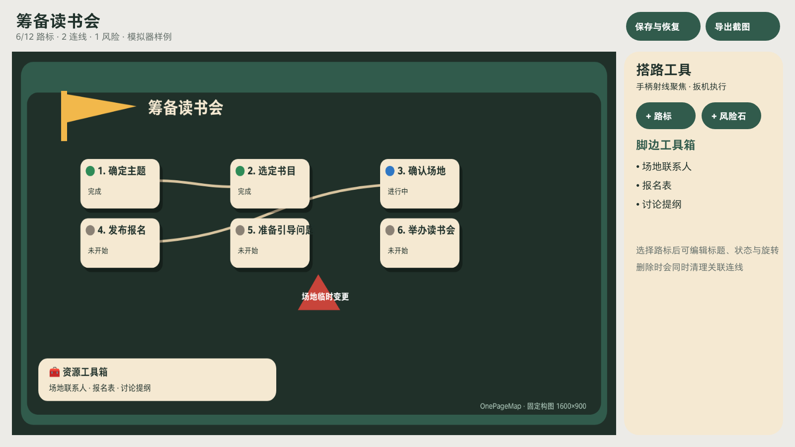
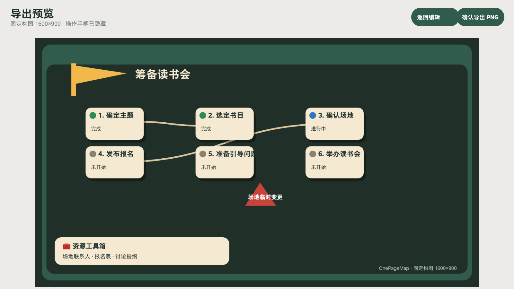

# OnePageMap（一页路线图）

OnePageMap 是一个面向个人小项目的中文 PICO 空间路线图应用。它用“终点目标、步骤路标、资源工具箱和风险石”帮助用户在空间中搭出一条通往目标的小路，不包含自动排期、关键路径等专业项目管理功能。

## 项目信息

- 包名：`com.pico.swan.onepagemap`
- 技术栈：Android、Kotlin、Jetpack Compose、PICO Spatial SDK 0.13.3
- 空间形态：Planar `DefaultWindowContainer`
- 本地数据：最多 10 份保存方案，并支持未保存草稿恢复
- 导出格式：固定构图 1600 × 900 PNG

## 主要功能

- 提供空白、活动筹备、学习计划、产品上线四个模板。
- 最终目标是一张可拖动的终点卡，可接收步骤连线。
- 每份路线图最多包含 12 张步骤卡，步骤支持未开始、进行中、完成三种状态。
- 步骤卡支持抓取移动及整体旋转，旋转后文字随卡片保持一致。
- 从步骤连接点拖动时显示实时虚线贝塞尔轨迹；靠近有效目标后轨迹变绿并高亮吸附目标，松开才创建连线。
- 选择步骤后可逐条删除相连路线，删除连线不会删除步骤或最终目标。
- 风险石可以在整个安全画布范围内自由摆放，并显示最近的步骤。
- 资源工具箱用于记录简短的资源名称。
- 删除步骤时会同步清理关联连线；重复连线、自连线、空目标和超过 12 张卡均有明确提示。
- 编辑器中的“使用帮助”是只读引导，关闭、返回或完成引导都会回到原来的未保存编辑，不会新建方案。
- 导出确认页会约束预览尺寸，导出成功后自动返回编辑器。
- 所有核心操作均可使用 PICO 手柄射线和扳机完成。

## 快速使用

1. 选择模板；初次使用推荐“活动筹备”。
2. 输入最终目标并生成终点卡。
3. 新建或选择步骤卡，修改标题与状态。
4. 按住扳机拖动步骤卡；使用旋转按钮调整方向。
5. 从步骤右下角连接点按住并拖动，根据虚线预览指向另一张步骤卡或最终目标；轨迹变绿后松开。
6. 选择步骤，在“相连路线”区域可单独删除不需要的连线。
7. 创建风险石并拖到相关步骤附近，在资源工具箱中补充所需资源。
8. 进入“保存与恢复”保存方案，或进入“导出截图”生成 PNG。

手柄操作：射线指向控件，按扳机确认；按住扳机并移动可拖拽。系统返回键用于退出当前页面。

## 开发环境

- JDK 17
- Android SDK
- PICO Spatial SDK 0.13.3
- 可选：`pico-cli`，用于模拟器或真机安装与调试

## 构建与测试

在项目根目录执行：

```powershell
.\gradlew.bat testDebugUnitTest assembleDebug
```

生成的调试 APK 位于：

```text
app/build/outputs/apk/debug/app-debug.apk
```

如果系统默认 Java 不是 JDK 17，可在当前 PowerShell 会话中先设置：

```powershell
$env:JAVA_HOME = "C:\path\to\jdk-17"
$env:PATH = "$env:JAVA_HOME\bin;$env:PATH"
```

## 安装到 PICO 设备

先查看已连接设备：

```powershell
pico-cli device list --format json
```

明确指定真实设备 ID 安装和启动，避免误装到模拟器：

```powershell
pico-cli app install --device <device-id> app/build/outputs/apk/debug/app-debug.apk
pico-cli app launch --device <device-id> com.pico.swan.onepagemap --activity .platform.LaunchActivity
```

## 模拟器样例

应用支持三个演示启动模式：

```powershell
adb -s emulator-5554 shell am start -n com.pico.swan.onepagemap/.platform.LaunchActivity --es demo_mode guide
adb -s emulator-5554 shell am start -n com.pico.swan.onepagemap/.platform.LaunchActivity --es demo_mode editor
adb -s emulator-5554 shell am start -n com.pico.swan.onepagemap/.platform.LaunchActivity --es demo_mode export
```

`editor` 和 `export` 会载入“筹备读书会”六步样例；`export` 会额外执行一次 MediaStore PNG 导出。

## 界面预览





## 目录说明

```text
app/src/main/          应用代码与资源
app/src/test/          单元测试
artifacts/             模拟器与导出验收截图
OnePageMap-design/     产品、交互与视觉设计交付文档
AGENTS.md              工程维护说明
```

## 数据与权限

- 路线方案和草稿保存在设备本地。
- 导出的图片写入设备的 `Pictures/OnePageMap`。
- 项目不包含云同步、账号系统或远程数据上传功能。

## 当前限制

- 不提供自动排期、关键路径、甘特图或多人协作。
- 连线仅提供简单贝塞尔曲线与重叠偏移，不进行自动布局。
- 空间窗口的自动化点击能力有限，手柄交互需要在模拟器或真实头显中人工体验确认。
